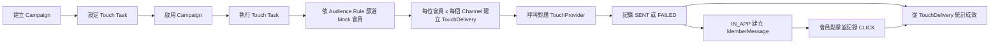

# 電商活動觸達任務系統

繁體中文 | [English](#e-commerce-campaign-touch-task-system)

Spring Boot MVP 後端服務，用於管理電商行銷活動、觸達任務、Mock 訊息派送、會員站內信、點擊追蹤與活動成效統計。

本專案嚴格遵守 `docs_AI_READY_PRD_V1_MVP.md` 與 `AGENTS.md` 定義的產品範圍與工程邊界。

## 專案摘要

系統提供管理者完成以下流程：

- 建立與管理行銷活動。
- 在活動底下建立觸達任務，設定客群規則與觸達渠道。
- 手動執行觸達任務。
- 透過 Mock Member Profile Client 模擬既有會員系統查詢目標會員。
- 透過 Mock Touch Provider 模擬 `IN_APP`、`EMAIL`、`PUSH` 派送。
- 僅針對 `IN_APP` 派送建立會員站內信。
- 追蹤會員站內信點擊。
- 以 `touch_delivery` 為主要資料來源查詢活動成效。

MVP 不實作既有電商平台的基礎領域，例如會員管理、商品、訂單、優惠券、付款、購物車或庫存。

## 完整操作流程

這個 MVP 將「設定要觸達誰、用什麼方式觸達」與「實際執行觸達」分成兩個階段。建立 Touch Task 只會保存規則，不會立刻寄送；管理者必須另外呼叫 execute API 才會開始篩選會員與派送。



### 1. 建立 Campaign

管理者先透過 `POST /api/admin/campaigns` 建立活動。新活動狀態為 `DRAFT`，可以先編輯活動內容並建立 Touch Task。

Campaign 的主要狀態流程為：

```text
DRAFT -> ACTIVE -> PAUSED -> ACTIVE
   |         |         |
   +---------+---------+-> ENDED
```

- `DRAFT` 或 `PAUSED` 可以啟用為 `ACTIVE`。
- 只有 `ACTIVE` 可以暫停為 `PAUSED`。
- 非 `ENDED` 活動可以結束；`ENDED` 不能再次啟用。
- Touch Task 真正執行時，Campaign 必須是 `ACTIVE`。

### 2. 設定 Touch Task 與觸達條件

透過 `POST /api/admin/campaigns/{campaignId}/touch-tasks` 建立任務。此步驟設定：

- `audienceRule`：要觸達哪些會員。
- `channels`：透過哪些渠道觸達，可使用 `IN_APP`、`EMAIL`、`PUSH`，不可重複。
- `messageTitle`、`messageContent`：派送內容。

目前支援的 Audience Rule：

| 欄位 | 型別 | 意義 |
| --- | --- | --- |
| `memberLevels` | string array | 會員等級符合陣列中的任一值，例如 `VIP` 或 `GOLD` |
| `lastLoginDaysLessThan` | positive integer | 最後登入時間在最近指定天數以內 |
| `favoriteCategories` | string array | 會員偏好分類至少符合陣列中的一個分類 |
| `hasCartItems` | boolean | 會員是否有購物車商品 |

不同欄位之間採 **AND**；同一陣列中的值採 **OR**。未提供或為空陣列的條件不限制會員。例如：

```json
{
  "memberLevels": ["VIP", "GOLD"],
  "lastLoginDaysLessThan": 30,
  "favoriteCategories": ["3C"],
  "hasCartItems": true
}
```

表示會員必須是 `VIP` 或 `GOLD`，同時最近 30 天內登入、偏好包含 `3C`，而且購物車內有商品。規則會以 JSONB 保存於 `touch_task.audience_rule_json`。新任務狀態為 `PENDING`，此時尚未執行任何派送。

### 3. 執行 Touch Task

管理者呼叫 `POST /api/admin/touch-tasks/{taskId}/execute` 後，系統依序執行：

1. 確認 Touch Task 為 `PENDING`，且所屬 Campaign 為 `ACTIVE`。
2. 將任務狀態改為 `PROCESSING`。
3. `MockMemberProfileClient` 讀取 `backend/src/main/resources/mock/members.json`。
4. 使用任務的 `audienceRule` 篩選符合條件的會員。
5. 對每位目標會員的每個 channel 建立一筆 `touch_delivery`。例如 2 位會員選擇 3 個 channels，會建立 6 筆 delivery。
6. 呼叫 channel 對應的 `TouchProvider`，並依結果將 delivery 標記為 `SENT` 或 `FAILED`。
7. 每次成功或失敗都建立對應的 `SENT` 或 `FAILED` `campaign_event`。
8. 所有目標會員和 channels 處理完畢後，將任務標記為 `COMPLETED`。

只有 `PENDING` 任務能執行，因此 `COMPLETED` 任務不能重複執行。目前是管理者手動觸發的同步流程，MVP 沒有排程器、Queue 或背景 Worker。

### 4. 各觸達渠道的行為

| Channel | MVP 行為 | 建立 `member_message` | 支援點擊追蹤 |
| --- | --- | --- | --- |
| `IN_APP` | 模擬站內訊息派送並回傳成功 | 是，僅在派送成功時建立 | 是 |
| `EMAIL` | Mock Provider；有 email 時回傳成功，缺少 email 時失敗，不會真的寄信 | 否 | 否 |
| `PUSH` | Mock Provider；有 push token 時回傳成功，缺少 token 時失敗，不會真的推播 | 否 | 否 |

Provider 只回傳 `DeliveryResult`，由 `TouchExecutionService` 統一更新 delivery、建立事件，並且只替成功的 `IN_APP` delivery 建立 `member_message`。

### 5. 會員查詢與點擊站內訊息

會員透過 `GET /api/member/messages` 搭配 `X-Member-Id` 查詢自己的站內訊息，不能查看其他會員的訊息。

會員呼叫 `POST /api/member/messages/{messageId}/click` 時：

- 只能點擊自己的訊息。
- Campaign 必須仍為 `ACTIVE`。
- 第一次點擊會把 `member_message` 和對應 `touch_delivery` 更新為已點擊，並建立一筆 `CLICK` `campaign_event`。
- 重複點擊不會建立重複的 `CLICK` event。

### 6. 查詢 Campaign Analytics

管理者透過 `GET /api/admin/campaigns/{campaignId}/analytics` 查詢成效。統計以 `touch_delivery` 為主要事實來源，而不是以 `campaign_event` 計算：

- 目標會員數：delivery 中不重複的 `member_id` 數量。
- 派送數：所有 delivery 數量。
- 成功數：狀態為 `SENT` 或 `CLICKED`。
- 失敗數：狀態為 `FAILED`。
- 站內訊息點擊率：`IN_APP CLICKED / IN_APP (SENT + CLICKED)`；沒有成功站內訊息時為 `0`。

## 技術棧

- Java 17
- Spring Boot 3.x
- Spring Web
- Spring Data JPA
- Spring Validation
- PostgreSQL
- Flyway
- Springdoc OpenAPI Swagger UI
- Docker Compose
- JUnit 5 / Spring Boot Test
- Maven

## MVP 範圍

目前已實作的後端能力：

- Campaign 活動管理
- Touch Task 觸達任務管理
- Audience Rule 客群規則驗證
- Mock `MemberProfileClient`
- Mock `TouchProvider`
- `TouchDelivery`
- `MemberMessage`
- `CampaignEvent`
- `CampaignAnalytics`
- Swagger UI
- Flyway migration
- Docker Compose PostgreSQL
- JUnit tests

## 不在本次範圍

本 MVP 不包含：

- member table 或會員 CRUD
- product table 或商品 CRUD
- order table 或訂單建立
- coupon table 或優惠券領取流程
- payment flow
- cart table
- inventory table
- 真實 Email provider
- 真實 Push provider
- 登入系統
- Spring Security、JWT 或 OAuth2
- Redis、RabbitMQ、Kafka 或 Elasticsearch
- Vue、React 或任何前端

Mock 會員資料固定放在：

```text
backend/src/main/resources/mock/members.json
```

## 允許的資料表

MVP 只允許建立以下 business tables：

- `campaign`
- `touch_task`
- `touch_delivery`
- `member_message`
- `campaign_event`

Schema 由 Flyway 管理：

```text
backend/src/main/resources/db/migration/V1__init_schema.sql
```

## 環境設定

前置需求：

- Java 17
- Docker Desktop 或 Docker Engine
- Maven，或使用專案內建 Maven wrapper

啟動 PostgreSQL：

```bash
docker compose up -d postgres
```

執行測試：

```bash
cd backend
./mvnw test
```

啟動後端：

```bash
cd backend
./mvnw spring-boot:run
```

Application URL：

```text
http://localhost:8080
```

## Docker Compose 指令

啟動 PostgreSQL：

```bash
docker compose up -d postgres
```

查看 container 狀態：

```bash
docker compose ps
```

停止 PostgreSQL：

```bash
docker compose down
```

PostgreSQL 連線設定：

```text
Database: campaign_touch
Username: campaign_touch
Password: campaign_touch
Port: 5432
```

## Swagger URL

啟動後端後開啟：

```text
http://localhost:8080/swagger-ui.html
```

## Demo Curl Script

API 使用 HTTP Header 模擬身份：

- Admin APIs 需要 `X-Admin-User`
- Member APIs 需要 `X-Member-Id`

完整 demo flow：

```bash
BASE_URL="http://localhost:8080"
ADMIN_USER="admin-demo"
MEMBER_ID="1001"

CAMPAIGN_ID=$(
  curl -s -X POST "$BASE_URL/api/admin/campaigns" \
    -H "Content-Type: application/json" \
    -H "X-Admin-User: $ADMIN_USER" \
    -d '{
      "name": "Summer Promo",
      "type": "PROMOTION",
      "description": "MVP demo campaign",
      "landingPageUrl": "https://example.com/summer",
      "startTime": "2026-06-26T00:00:00",
      "endTime": "2026-07-31T23:59:59"
    }' | jq -r '.id'
)

curl -s -X POST "$BASE_URL/api/admin/campaigns/$CAMPAIGN_ID/activate" \
  -H "X-Admin-User: $ADMIN_USER"

TASK_ID=$(
  curl -s -X POST "$BASE_URL/api/admin/campaigns/$CAMPAIGN_ID/touch-tasks" \
    -H "Content-Type: application/json" \
    -H "X-Admin-User: $ADMIN_USER" \
    -d '{
      "taskName": "VIP multi-channel touch",
      "audienceRule": {
        "memberLevels": ["VIP", "GOLD"],
        "lastLoginDaysLessThan": 30,
        "favoriteCategories": ["3C"],
        "hasCartItems": true
      },
      "channels": ["IN_APP", "EMAIL", "PUSH"],
      "messageTitle": "Summer deal is live",
      "messageContent": "Open the campaign page to see the offer."
    }' | jq -r '.id'
)

curl -s -X POST "$BASE_URL/api/admin/touch-tasks/$TASK_ID/execute" \
  -H "X-Admin-User: $ADMIN_USER"

curl -s "$BASE_URL/api/member/messages?campaignId=$CAMPAIGN_ID" \
  -H "X-Member-Id: $MEMBER_ID"

MESSAGE_ID=$(
  curl -s "$BASE_URL/api/member/messages?campaignId=$CAMPAIGN_ID" \
    -H "X-Member-Id: $MEMBER_ID" | jq -r '.[0].id'
)

curl -s -X POST "$BASE_URL/api/member/messages/$MESSAGE_ID/click" \
  -H "X-Member-Id: $MEMBER_ID"

curl -s "$BASE_URL/api/admin/campaigns/$CAMPAIGN_ID/analytics" \
  -H "X-Admin-User: $ADMIN_USER"
```

如果沒有安裝 `jq`，可以手動執行 curl，並從 response 複製 `id` 到 `CAMPAIGN_ID`、`TASK_ID`、`MESSAGE_ID`。

## 測試指令

```bash
cd backend
./mvnw test
```

替代方式：

```bash
cd backend
mvn test
```

## Reviewer Checklist

驗收前請確認：

- 沒有新增 out-of-scope tables。
- 只建立 `campaign`、`touch_task`、`touch_delivery`、`member_message`、`campaign_event`。
- 沒有 member、product、order、coupon、payment、cart、inventory tables。
- 沒有加入 Redis、RabbitMQ、Kafka 或 Elasticsearch dependency。
- 沒有加入 Spring Security、JWT 或 OAuth2 dependency。
- 沒有加入 Vue、React 或任何 frontend。
- Mock member data 保持在 `backend/src/main/resources/mock/members.json`。
- Controller 不包含 business logic。
- Service 負責 business rules 與 transaction boundaries。
- API response 不直接暴露 Entity。
- Request/Response 使用 DTO。
- Schema 由 Flyway 建立。
- `spring.jpa.hibernate.ddl-auto=validate` 已設定。
- Analytics 以 `touch_delivery` 作為主要資料來源。
- `campaign_event` 僅作為 event log，不作為主要 analytics source。
- `./mvnw test` 通過。
- PostgreSQL 啟動後 application startup 成功。
- Swagger 可在 `http://localhost:8080/swagger-ui.html` 開啟。

---

# E-Commerce Campaign Touch Task System

[繁體中文](#電商活動觸達任務系統) | English

Spring Boot MVP backend for managing e-commerce marketing campaigns, touch tasks, mock message delivery, member in-app messages, click tracking, and campaign analytics.

This repository follows the product and engineering boundaries in `docs_AI_READY_PRD_V1_MVP.md` and `AGENTS.md`.

## Project Summary

The system lets an admin user:

- Create and manage marketing campaigns.
- Create touch tasks for a campaign with audience rules and delivery channels.
- Execute a touch task manually.
- Simulate member lookup through a mock member profile client.
- Simulate `IN_APP`, `EMAIL`, and `PUSH` delivery through mock providers.
- Create member messages only for `IN_APP` deliveries.
- Track in-app message clicks.
- Query campaign analytics from `touch_delivery`.

The MVP intentionally does not implement the existing e-commerce platform domains such as member management, products, orders, coupons, payments, carts, or inventory.

## End-to-End Workflow

This MVP separates task configuration from task execution. Creating a Touch Task only stores its targeting rules and channels; delivery starts only when an admin explicitly calls the execute API.

1. Create a Campaign with `POST /api/admin/campaigns`. A new Campaign starts in `DRAFT`.
2. Create a Touch Task with `POST /api/admin/campaigns/{campaignId}/touch-tasks`, configuring its `audienceRule`, channels, title, and content. A new task starts in `PENDING`.
3. Activate the Campaign. Only an `ACTIVE` Campaign can execute a task.
4. Execute the task with `POST /api/admin/touch-tasks/{taskId}/execute`. Only a `PENDING` task can run.
5. `MockMemberProfileClient` loads `backend/src/main/resources/mock/members.json` and applies the Audience Rule.
6. For every matched member and every configured channel, the service creates one `touch_delivery` and calls the matching `TouchProvider`.
7. The provider returns a `DeliveryResult`; the service records `SENT` or `FAILED` on the delivery and appends the corresponding `campaign_event`.
8. A successful `IN_APP` delivery also creates a `member_message`. `EMAIL` and `PUSH` never create member messages.
9. A member can query and click only their own messages. The first valid click updates the message and delivery and creates one `CLICK` event; repeated clicks are idempotent.
10. Campaign analytics are calculated primarily from `touch_delivery`.

### Audience Rule Semantics

Supported fields are:

| Field | Type | Meaning |
| --- | --- | --- |
| `memberLevels` | string array | Match any listed member level |
| `lastLoginDaysLessThan` | positive integer | Last login occurred within the specified number of days |
| `favoriteCategories` | string array | Match at least one listed favorite category |
| `hasCartItems` | boolean | Match the member's cart-item flag |

Different fields use **AND** semantics, while values inside one array use **OR** semantics. Missing fields and empty arrays do not restrict the result. The rule is stored in `touch_task.audience_rule_json`.

### Execution And Channel Behavior

During execution, the task moves from `PENDING` to `PROCESSING`, then to `COMPLETED` after all matched members and channels have been handled. A completed task cannot run again. Execution is synchronous and manually triggered; this MVP has no scheduler, queue, or background worker.

| Channel | MVP behavior | Creates `member_message` | Click tracking |
| --- | --- | --- | --- |
| `IN_APP` | Simulates a successful in-app delivery | Yes, after successful delivery | Yes |
| `EMAIL` | Mock only; succeeds when email exists and fails when missing | No | No |
| `PUSH` | Mock only; succeeds when a push token exists and fails when missing | No | No |

No real email or push message is sent in this MVP. The provider returns only a `DeliveryResult`; `TouchExecutionService` owns delivery updates, event creation, and creation of successful in-app member messages.

## Tech Stack

- Java 17
- Spring Boot 3.x
- Spring Web
- Spring Data JPA
- Spring Validation
- PostgreSQL
- Flyway
- Springdoc OpenAPI Swagger UI
- Docker Compose
- JUnit 5 / Spring Boot Test
- Maven

## MVP Scope

Implemented backend capabilities:

- Campaign management
- Touch Task management
- Audience Rule validation
- Mock `MemberProfileClient`
- Mock `TouchProvider`
- `TouchDelivery`
- `MemberMessage`
- `CampaignEvent`
- `CampaignAnalytics`
- Swagger UI
- Flyway migration
- Docker Compose PostgreSQL
- JUnit tests

## Out Of Scope

This MVP must not include:

- Member table or member CRUD
- Product table or product CRUD
- Order table or order creation
- Coupon table or coupon claim flow
- Payment flow
- Cart table
- Inventory table
- Real Email provider
- Real Push provider
- Login system
- Spring Security, JWT, or OAuth2
- Redis, RabbitMQ, Kafka, or Elasticsearch
- Vue, React, or any frontend

Mock member data stays in:

```text
backend/src/main/resources/mock/members.json
```

## Allowed Database Tables

Only these business tables are allowed:

- `campaign`
- `touch_task`
- `touch_delivery`
- `member_message`
- `campaign_event`

Schema is managed by Flyway:

```text
backend/src/main/resources/db/migration/V1__init_schema.sql
```

## Setup Instructions

Prerequisites:

- Java 17
- Docker Desktop or Docker Engine
- Maven, or use the included Maven wrapper

Start PostgreSQL:

```bash
docker compose up -d postgres
```

Run tests:

```bash
cd backend
./mvnw test
```

Run the backend:

```bash
cd backend
./mvnw spring-boot:run
```

The application runs on:

```text
http://localhost:8080
```

## Docker Compose Instructions

Start PostgreSQL:

```bash
docker compose up -d postgres
```

Check container status:

```bash
docker compose ps
```

Stop PostgreSQL:

```bash
docker compose down
```

The PostgreSQL service uses:

```text
Database: campaign_touch
Username: campaign_touch
Password: campaign_touch
Port: 5432
```

## Swagger URL

After starting the backend, open:

```text
http://localhost:8080/swagger-ui.html
```

## Demo Curl Script

The API uses headers to simulate identity:

- Admin APIs require `X-Admin-User`.
- Member APIs require `X-Member-Id`.

Example end-to-end demo:

```bash
BASE_URL="http://localhost:8080"
ADMIN_USER="admin-demo"
MEMBER_ID="1001"

CAMPAIGN_ID=$(
  curl -s -X POST "$BASE_URL/api/admin/campaigns" \
    -H "Content-Type: application/json" \
    -H "X-Admin-User: $ADMIN_USER" \
    -d '{
      "name": "Summer Promo",
      "type": "PROMOTION",
      "description": "MVP demo campaign",
      "landingPageUrl": "https://example.com/summer",
      "startTime": "2026-06-26T00:00:00",
      "endTime": "2026-07-31T23:59:59"
    }' | jq -r '.id'
)

curl -s -X POST "$BASE_URL/api/admin/campaigns/$CAMPAIGN_ID/activate" \
  -H "X-Admin-User: $ADMIN_USER"

TASK_ID=$(
  curl -s -X POST "$BASE_URL/api/admin/campaigns/$CAMPAIGN_ID/touch-tasks" \
    -H "Content-Type: application/json" \
    -H "X-Admin-User: $ADMIN_USER" \
    -d '{
      "taskName": "VIP multi-channel touch",
      "audienceRule": {
        "memberLevels": ["VIP", "GOLD"],
        "lastLoginDaysLessThan": 30,
        "favoriteCategories": ["3C"],
        "hasCartItems": true
      },
      "channels": ["IN_APP", "EMAIL", "PUSH"],
      "messageTitle": "Summer deal is live",
      "messageContent": "Open the campaign page to see the offer."
    }' | jq -r '.id'
)

curl -s -X POST "$BASE_URL/api/admin/touch-tasks/$TASK_ID/execute" \
  -H "X-Admin-User: $ADMIN_USER"

curl -s "$BASE_URL/api/member/messages?campaignId=$CAMPAIGN_ID" \
  -H "X-Member-Id: $MEMBER_ID"

MESSAGE_ID=$(
  curl -s "$BASE_URL/api/member/messages?campaignId=$CAMPAIGN_ID" \
    -H "X-Member-Id: $MEMBER_ID" | jq -r '.[0].id'
)

curl -s -X POST "$BASE_URL/api/member/messages/$MESSAGE_ID/click" \
  -H "X-Member-Id: $MEMBER_ID"

curl -s "$BASE_URL/api/admin/campaigns/$CAMPAIGN_ID/analytics" \
  -H "X-Admin-User: $ADMIN_USER"
```

If `jq` is not installed, run the same curl commands manually and copy the returned `id` values into `CAMPAIGN_ID`, `TASK_ID`, and `MESSAGE_ID`.

## Test Command

```bash
cd backend
./mvnw test
```

Alternative:

```bash
cd backend
mvn test
```

## Reviewer Checklist

Before accepting changes, verify:

- No out-of-scope tables were added.
- Only `campaign`, `touch_task`, `touch_delivery`, `member_message`, and `campaign_event` are created.
- No member, product, order, coupon, payment, cart, or inventory tables exist.
- No Redis, RabbitMQ, Kafka, or Elasticsearch dependency was added.
- No Spring Security, JWT, or OAuth2 dependency was added.
- No Vue, React, or frontend was added.
- Mock member data stays in `backend/src/main/resources/mock/members.json`.
- Controllers do not contain business logic.
- Services handle business rules and transaction boundaries.
- Entities are not exposed directly by API responses.
- DTOs are used for request and response objects.
- Flyway creates the schema.
- `spring.jpa.hibernate.ddl-auto=validate` is configured.
- Analytics use `touch_delivery` as the primary source of truth.
- `campaign_event` remains an event log, not the main analytics source.
- `./mvnw test` passes.
- Application startup succeeds with PostgreSQL running.
- Swagger is available at `http://localhost:8080/swagger-ui.html`.
